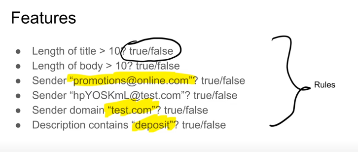
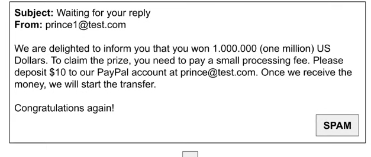
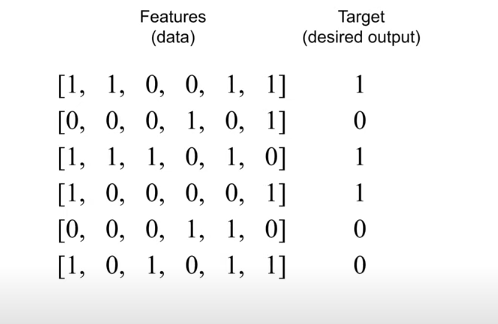

## Table of Contents
- [Introduction to Machine Learning](#mlz-11---intro-to-ml)
- [ML v/s Rule-Based System](#mlz-12---ml-vs-rule-based-systems)

### MLZ 1.1 - Intro to ML

[YT Link](https://youtu.be/Crm_5n4mvmg?si=Brl55f-46slXZfT-)

Let's understand ML with an example - imagine we have a car classifieds website with prices and pictures of different cars and models and you want to sell yours on the platform. 

You'll sign in first, then be asked to fill a form with fields like car model, price etc.

Problem arises when you have to set a selling price-- you don't want it to be too high or too low, so you go through other listings/ads to figure out a an appropriate and reasonable price for yours. As the developers of the website, how can we make this easy on our users? By using machine learning. 

Facts to consider when setting the price: 
- Year
- Make 
- Mileage, etc. 

So this data will have to be fed into a model to derive/understand patterns-- and thereby, make reasonable selling price recommendation for the user's car. This model will have to "learn" all available data (like above). 

Now, these facts become "features", and the price to be predicted becomes "target"!

Features + Target ---train---> Model
Model ---predict---> predictons (target values for the car/object)

### MLZ 1.2 - ML v/s Rule-Based Systems  

Let's consider a spam detection system. 

<b>Rule-Based</b>

You're recieving unsolicited messages/promotions and you want to detect and block these. To do this, we'll need to build a classifier to detect emails as spam or not spam. 

Ex. 
If sender = "promotions@online.com" or 
if title contains "tax review" and domain = "online.com" then "spam" 
else "not spam"

these rules encoded in python is a rule-based code system. 

This method works as long as the spam emails are easily identifiable/direct... but some emails, for example, may have spam-content in the body-- ex. "you've won 1 mil dollas, deposit 10 dollars in x account to recieve it". Here, you can look for the word "deposit" (add another rule)

Again, this can work for a while, until the sender is legitimate and is really asking for a deposit. Maybe you can add another condition, but this will go on for several (inf) iterations based on different inputs and you'll have to keep adding/updating/changing code.

To solve this problem now, we need a more scalable solution. Here's where ML comes into the picture. You create one ML model and keep supplying a bunch of well-defined inputs (features) to it. Start with the rules and 

Ex. Consider binary features (rules that output to either true or false) for a test email. 

Email:

Based on the features and target, we can generate the below dataset and target var values:  

Length of title > 10 - 1 
Length of body > 10 - 1 
sender "promotions@online.com" - 0 
sender "hpY....@test.com" - 0 
sender domain "test.com" - 1 
"deposit" in body - 1 

user marked the email as "spam" - 1 

Therefore, 

| Features (data) | Target (desired output) | 
| -------------------- | ------------- | 
| [1,1,0,0,1,1]     | 1      |

We keep doing this for more emails until we have:

We take this data and feed it into the ML algo (ex. decision tree, Logistic regression etc) to "train it" and generate a Model. 

Algorithm - procedure for learning patterns from data (method)
Model - trained outcome of applying algorithm to your data. (result of applying method to data)

Once your algorithm is trained, it becomes a trained model. Then, you can feed unseen/new data into the trained model to make predictions.