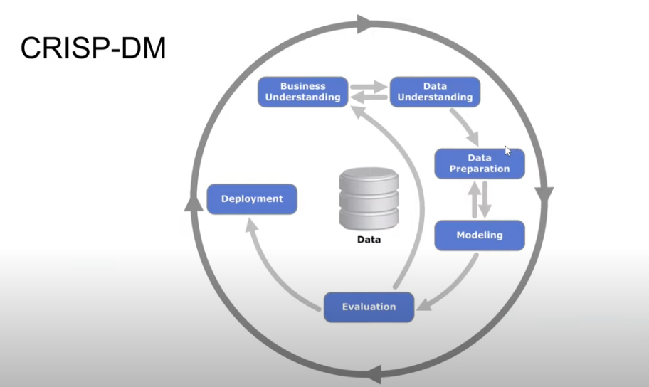
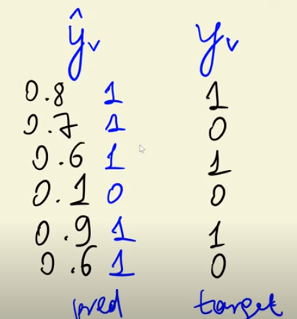

## Table of Contents
- [Introduction to Machine Learning](#mlz-11---intro-to-ml)
- [ML v/s Rule-Based System](#mlz-12---ml-vs-rule-based-systems)
- [Supervised Machine Learning](#mlz-13---supervised-machine-learning)
- [CRISP-DM ML](#mlz-14---crisp-dm)

### MLZ 1.1 - Intro to ML

[YT Link](https://youtu.be/Crm_5n4mvmg?si=Brl55f-46slXZfT-)

Let's understand ML with an example - imagine we have a car classifieds website with prices and pictures of different cars and models and you want to sell yours on the platform. 

You'll sign in first, then be asked to fill a form with fields like car model, price etc.

Problem arises when you have to set a selling price-- you don't want it to be too high or too low, so you go through other listings/ads to figure out a an appropriate and reasonable price for yours. As the developers of the website, how can we make this easy on our users? By using machine learning. 

Facts to consider when setting the price: 
- Year
- Make 
- Mileage, etc. 

So this data will have to be fed into a model to derive/understand patterns-- and thereby, make reasonable selling price recommendation for the user's car. This model will have to "learn" all available data (like above). 

Now, these facts become "features", and the price to be predicted becomes "target"!

Features + Target ---train---> Model
Model ---predict---> predictons (target values for the car/object)

### MLZ 1.2 - ML v/s Rule-Based Systems  

Let's consider a spam detection system. 

<b>Rule-Based</b>

You're recieving unsolicited messages/promotions and you want to detect and block these. To do this, we'll need to build a classifier to detect emails as spam or not spam. 

Ex. 
If sender = "promotions@online.com" or 
if title contains "tax review" and domain = "online.com" then "spam" 
else "not spam"

these rules encoded in python is a rule-based code system. 

This method works as long as the spam emails are easily identifiable/direct... but some emails, for example, may have spam-content in the body-- ex. "you've won 1 mil dollas, deposit 10 dollars in x account to recieve it". Here, you can look for the word "deposit" (add another rule)

Again, this can work for a while, until the sender is legitimate and is really asking for a deposit. Maybe you can add another condition, but this will go on for several (inf) iterations based on different inputs and you'll have to keep adding/updating/changing code.

To solve this problem now, we need a more scalable solution. Here's where ML comes into the picture. You create one ML model and keep supplying a bunch of well-defined inputs (features) to it. Start with the rules and 

Ex. Consider binary features (rules that output to either true or false) for a test email. 

Email:

Based on the features and target, we can generate the below dataset and target var values:  

Length of title > 10 - 1 
Length of body > 10 - 1 
sender "promotions@online.com" - 0 
sender "hpY....@test.com" - 0 
sender domain "test.com" - 1 
"deposit" in body - 1 

user marked the email as "spam" - 1 

Therefore, 

| Features (data) | Target (desired output) | 
| -------------------- | ------------- | 
| [1,1,0,0,1,1]     | 1      |

We keep doing this for more emails until we have:

We take this data and feed it into the ML algo (ex. decision tree, Logistic regression etc) to "train it" and generate a Model. 

Algorithm - procedure for learning patterns from data (method)
Model - trained outcome of applying algorithm to your data. (result of applying method to data)

Once your algorithm is trained, it becomes a trained model. Then, you can feed unseen/new data into the trained model to make predictions.

### MLZ 1.3 - Supervised Machine Learning

[YT Link](https://youtu.be/j9kcEuGcC2Y?si=asafcY02jlVd7qaZ)

The features data is called "Feature Matrix", a 2-D array where rows are objects for which we want to predict something and columns are features (object here for example is an email, and features is for example a word we're looking for in the email body/object) 

Feature Matrix is referenced with X() - function X. 
y is a vector for target variable, a 1-D array. 

g(X) ~ y 

g is the model - using X as input, the model will attempt to produce something that is approximtely close to y. 

Email Classification: In Depth

#### Machine Learning Example: Spam Email Classification

---

#### 1️⃣ Problem Statement
We want to classify emails as **spam** or **not spam** based on certain features.  
This is an example of **supervised learning**, where we have a dataset with known targets (labels).

---

#### 2️⃣ Dataset

##### Features
- **num_links**: Number of links in the email  
- **has_free**: Whether the email contains the word “free” (1 = yes, 0 = no)  
- **email_length**: Number of words in the email  

##### Target
- **spam**: 1 = Spam, 0 = Not Spam

#### Example Training Data

| Email | num_links | has_free | email_length | Target (spam=1) |
|-------|-----------|----------|--------------|----------------|
| 1     | 5         | 1        | 50           | 1              |
| 2     | 0         | 0        | 200          | 0              |
| 3     | 2         | 1        | 120          | 1              |
| 4     | 0         | 0        | 180          | 0              |
| 5     | 1         | 0        | 100          | 0              |

- Feature matrix: each row represents an email’s features  
- Target vector: each row’s corresponding label (spam/not spam)

---

#### 3️⃣ Model

We use a **simple linear model**:  

- Each feature has a **weight** (importance)  
- There is a **bias** (base score)  
- Training adjusts the weights and bias so the model predicts the target correctly  

##### Example trained parameters

| Feature       | Weight |
|---------------|--------|
| num_links     | 0.4    |
| has_free      | 0.6    |
| email_length  | -0.01  |
| Bias          | -0.5   |

**Interpretation:**
- Positive weight → feature increases likelihood of spam  
- Negative weight → feature decreases likelihood of spam  
- Bias shifts the prediction up or down  

---

#### 4️⃣ Training

- Training uses **emails with known labels**  
- Model learns which features are important for predicting spam  
- After training, it can predict spam for **new emails**  

---

#### 5️⃣ Prediction Example

###### New Email Features

| num_links | has_free | email_length |
|-----------|----------|--------------|
| 3         | 1        | 80           |

##### Step-by-Step Calculation (Plain Text)

1. Contribution from **num_links**: 3 × 0.4 = 1.2  
2. Contribution from **has_free**: 1 × 0.6 = 0.6  
3. Contribution from **email_length**: 80 × (-0.01) = -0.8  
4. Add bias: -0.5  

**Total score** = 1.2 + 0.6 - 0.8 - 0.5 = 0.5  

---

#### 6️⃣ Classification Threshold

- Threshold = 0.5  
  - Score ≥ 0.5 → Spam  
  - Score < 0.5 → Not Spam  

- Here, **score = 0.5 → classified as spam**  

**Note:** Threshold can be adjusted to reduce false positives or false negatives.

---

#### 7️⃣ Summary

1. **Features**: Characteristics of emails  
2. **Target**: Labels in training data  
3. **Model**: Learns weights and bias to map features → target  
4. **Parameters**: Weights and bias are learned during training  
5. **Prediction**: Feed new email features → compute score → compare to threshold → classify  

---

There are different types of supervised machine learning models. 
- Regression (ex. for predictive analysis - car prices etc)
- Classification (ex. for image/object classification, spam emails, etc)
    - multiclass (car, cat, dog etc)
    - binary (1,0 or true, false or cat, not cat etc)
- Ranking (ex. recommendation systems, relevance ranking, etc)

### MLZ 1.4 - CRISP DM

[YT Link](https://youtu.be/dCa3JvmJbr0?si=XDl1MN7gUlHcNTuH)

CRISP-DM stands for Cross Industry Standard Processing and data mining. It's a methodology used to organize ML projects. 

ML Projects Steps:
- Understand the problem
- Collect the data
- Train the model 
- Use the model

1. Business Understanding 
    - Understand the problem (ex. users receiving a lot of spam emails)
    - Define business goals (ex. reduce/block spam emails)
    - Come up with a measureable metric for the goals. (ex. reduce spam emails by 50%)

2. Data Understaning 
    - Assess availability of data
    - Identify sources 
    - Analyze 

3. Data Preparation: We have enough data, and we know it's reliabale. 
    - Clean data 
    - Build the pipelines
    - Convert to tabular form

4. Modeling: We try different models and select the best one. 

5. Evaulation: Measure how well the model performs.

6. Deployment: Deploy the model to production (generally happens with evaluation + the model is evaluated first on a set no. of users, then rolled out for everyone)

7. Iteration: ML projects need a lot of iterations!

### MLZ 1.5 - Model Selection Process

Let's say it's July, and we train the model g with X(). We'll take the data from July and before. 

In July, we'll take the entire dataset we have and divide it into 20%-80% chunks. We take the 20% and set it aside--pretend it doesn't exist. We use the 80% of the data for training. We'll just assume the 20% is from the next month (i.e August, here). The 20% is validation dataset. 

TRAIN :
X, y and model g 

VALIDATION : 
Xv, yv

g(Xv) = y^v 

Then, we compare y^v  with the actual yv

where the y^v values are predictions (if >=0.5 then Spam(1), else not Spam(0))

so, here 4/6 are correctly classified, i.e the model is 66% accurate. 

This was Logestic Regression, let's say. 

Then, we take a Decision Tree, and it's accuracy let's say is 60%

Random forest is 67% correct 

Neural Network is 80% correct 

i.e NN is the best model. 

So, generally, this is how the model selection process works.

But a problem arises in such a case - **multiple comparison or multiple testing problem!** 

It happens when you run many statistical tests or comparisons on the same data, and the chance of finding something that looks "significant" just by random chance goes way up. The multiple comparison problem in ML is when running lots of tests/comparisons makes it likely you’ll find "false patterns." It’s like flipping 100 coins and being surprised when one lands heads 10 times in a row — it’s not magic, just probability.

A very simple example is:
Say you want to see if wearing red shoes makes people better at math.

You test 20 random things (red shoes, blue shirts, coffee, socks, etc.).

By pure chance, 1 of them will probably look like it "helps."

You might mistakenly believe red shoes cause better math scores, but really it’s just randomness.

<b>To counter this we split our dataset into validation and test sets. <b>

Ex. 60% TRAIN, 20% VALIDATION, 20% TEST

so we train the 60% and validate with the 20%, then decide NN model is the most accurate. To confirm that, we apply the NN algo to the 20% test dataset (Xt, yt)  

During **Test**, the 60+20% becomes one large train dataset.  

### MLZ 1.6 - Github Codespaces

