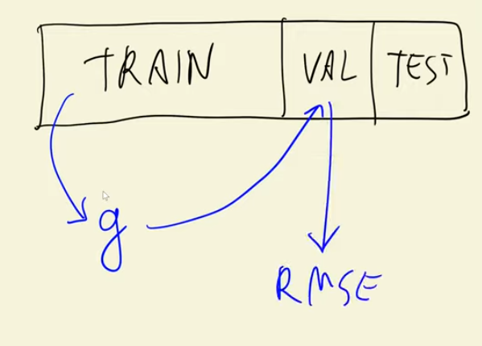

## Table of Contents 
- [Dataset - Car Price Prediction Project](#21-car-price-prediction-project)


### 2.1 Car Price Prediction Project
This project is about the creation of a model for helping users to predict car prices. The dataset was obtained from [this 
kaggle competition](https://www.kaggle.com/CooperUnion/cardataset).

**Project plan:**

* Prepare data and Exploratory data analysis (EDA)
* Use linear regression for predicting price
* Understanding the internals of linear regression 
* Evaluating the model with RMSE
* Feature engineering  
* Regularization 
* Using the model 

The code and dataset are available at this [link](https://github.com/alexeygrigorev/mlbookcamp-code/tree/master/chapter-02-car-price). 


### 2.2 Data Preparation 

Check the [notebook](../data-prep.ipynb)

## 2.3 Exploratory Data Analysis

Check the [notebook](../data-prep.ipynb)

## 2.4 Setting up the validation framework

Split dataset into Train, Test and Validation. 

- Train - X<sup>T<sup> (feature matrix), y<sup>T<sup> (target value) (60%)

- Validation - X<sup>v<sup> (feature matrix), y<sup>v<sup> (target value) (20%)

- Test - X<sup>test<sup> (feature matrix), y<sup>test<sup> (target value) (20%)

Check the [notebook](../data-prep.ipynb)

Summary:

Steps to set up a validation framework:

1. Divide your dataset into Train, Test and Validation dataframes. 

    1.1. Count the len of each partition 

    1.2. Use iloc[] to create the dataframes, i.e `train = df.iloc[:len(60% of dataset)]`, `test = df.iloc[len(60% of dataset):len(len(60% of dataset) + len(20% of dataset)]`, 
    `val = df.iloc[len(60% of dataset) + len(20% of dataset):]`


2. If the original data is in an ordered format, reshuffle it by the index then reassign. 

    2.1. Generate index value of the dataset using `idx=np.arange(len(entire dataset))`

    2.2. **Remember to use seed when reshuffling** - `np.random.seed(2)` 
    then, `np.random.shuffle(idx)`

    2.3. Use idx (array) inside iloc when doing the above (step 1.2.) - so, train=df.iloc[idx[:len(60% of train)]]

    2.4. Reset the reshuffled index

3. Create target variables for each test, train and validation datasets (using the target value, which here is car price)

4. **Delete the target values from the test, train and val datasets** so you don't accidentally use the feature to be predicted in the feature matrix.


## 2.5 Linear Regression  

Is a model that we use to predict numbers (o/p of the model is a number). 

`g(X) ~ y`

where, 
g = model (linear regression)<br>
X = feature matrix<br>
y = target (here, price)<br>

so, let's look at one car **i**, 

g(x<sub>i</sub>) ~ y<sub>i</sub>

where x<sub>i</sub> is a vector, 

x<sub>i</sub> = (x<sub>i1</sub>, x<sub>i2</sub>, x<sub>i3</sub>... x<sub>in</sub>) 

x<sub>i1 - n</sub> - different characteristics of the car. 

we should combine the values/characteristics in a way such that the output we get the corresponding y

Regression Formula 

g(xi) = w0 + w1.xi1 + w2.xi2 + w3.xi3 + .... 

where w0 = bias term, 
w1 - Weight of the first characteristtics (in our example, its horsepower)
Xi1 - First characteristic value
etc. 

g(xi) = w0 + $\sum_{j=0}^{n-1} wj.xij$

Check the [notebook](../data-prep.ipynb)


## 2.6 Linear Regression: Vector Form

Generalizing here, 

Check the [notebook](../data-prep.ipynb)

## 2.7 Training Linear Regression: Normal Equation

How to set the weights, bias term etc. 

;-; lost my notes here 

will get back to it when I revise

.
.
.
.
.

w = (X<sup>t</sup>X)<sup>-1</sub>X<sup>t</sup>y

<details><summary>SUMMARY:</summary>

# Linear Regression: Finding Weights and Bias Step-by-Step

## Goal
We want a line (or hyperplane) that predicts output \(y\) from features \(X\):

\[
\hat{y} = Xw + b
\]

Where:  
- \(X\) = input features (matrix of size `n_samples × n_features`)  
- \(w\) = weights (slopes for each feature)  
- \(b\) = bias (intercept)  
- \(\hat{y}\) = predicted output

---

## Step 1: Represent bias as a weight
To simplify math, we **add a column of 1s** to \(X\), so the bias \(b\) becomes just another weight:

\[
X' = [X \quad 1], \quad w' = 
\begin{bmatrix} w \\ b \end{bmatrix}
\]

Now predictions are:

\[
\hat{y} = X' w'
\]

**Intuition:**  
- `w` multiplies each feature  
- `b` multiplies 1 → just adds a constant to every prediction

---

## Step 2: Write the loss function
We want the line to fit the data **as best as possible**, meaning minimizing **squared errors**:

\[
J(w') = \sum_{i=1}^{n} (y_i - \hat{y}_i)^2 = (y - X' w')^T (y - X' w')
\]

---

## Step 3: Solve using the Normal Equation
Take the derivative of \(J(w')\) w.r.t \(w'\) and set it to 0:

\[
\frac{\partial J}{\partial w'} = -2 X'^T y + 2 X'^T X' w' = 0
\]

Simplify:

\[
X'^T X' w' = X'^T y
\]

Solve for \(w'\):

\[
\boxed{w' = (X'^T X')^{-1} X'^T y}
\]

- This is called the **Normal Equation**.  
- \(w'\) includes all feature weights **and** the bias.

---

## Step 4: Prepare the data in Python
```python
import numpy as np

# Example data
X = np.array([[1, 2],
              [2, 3],
              [3, 4]])
y = np.array([2, 3, 4])

#Add column of 1s for bias
X_b = np.column_stack((X, np.ones(X.shape[0])))

```
## Step 5: Compute Weights Including Bias
```
# Normal equation
w_b = np.linalg.inv(X_b.T.dot(X_b)).dot(X_b.T).dot(y)

print("Weights + Bias:", w_b)
```
Output 

[1. 1. 0.]


## Step 6: Make Predictions
```
y_hat = X_b.dot(w_b)
print("Predictions:", y_hat)

```
Output 

[2. 3. 4.]


</details>


## 2.8 Baseline Model for Car Price Prediction Project

Check the [notebook](../data-prep.ipynb)

## 2.9 RMSE 

Check the [notebook](../data-prep.ipynb)

## 2.10 Computing RMSE on Validation Dataset



Check the [notebook](../data-prep.ipynb)

## 2.11 Feature Engineering 

Check the [notebook](../data-prep.ipynb)

Feature engineering is the process of:

Creating, transforming, or selecting features from raw data so that your machine learning model performs better.

Common feature engineering techniques:

a) Creating new features

    Combine existing features: BMI = weight / height^2

    Extract information: day_of_week from a date column

b) Transforming features

    Scaling / normalization: make all features comparable

    Log, square root, or polynomial transformations for non-linear relationships

c) Encoding categorical variables

    Convert text to numbers:

    One-hot encoding (red, blue → [1,0], [0,1])

    Label encoding (red, blue → 0, 1)

d) Handling missing values

    Fill missing data with mean, median, mode, or a special value

e) Feature selection

    Remove irrelevant or redundant features

    Reduce noise, improve performance, reduce computation

## 2.12 Categorical Variables

Check the [notebook](../data-prep.ipynb)

## 2.13 Regularization

Check the [notebook](../data-prep.ipynb)

What is regularization?

Regularization helps control overfitting — when a model fits the training data too closely, including noise or random fluctuations, and fails to generalize to new (unseen) data.

It does this by adding a penalty term to the model’s loss function that discourages large or complex model parameters (like big weights in regression or neural networks).


The problem with duplicates in the feature matrix - XTX Inverse gives an error

A way to fix the problem - add a small number to the diagonal/matching row values. 

ex. if our array looks like - 
[
    [1,2,2],
    [2,1,1],
    [2,1,1]
]
then you can do 
[
    [1,2,2],
    [2,1,1.0001],
    [2,1.0000001,1]    
]

or add 

[
    [1.00001,2,2],
    [2,1,1.0001],
    [2,1.0000001,1.00001]    
]

the larger the number - the more we have it under control 

Why we need regularization?

Big weights = model relies heavily on specific features → more sensitive to noise.

Small weights = smoother, more robust predictions.

Regularization shrinks weights, making the model less sensitive to small changes in the data.

## 2.14 Tuning the Model


Check the [notebook](../data-prep.ipynb)

We're selecting the best regulaization parameter (i.e which gives the smallest RMSE)

## 2.15 Using the Model 