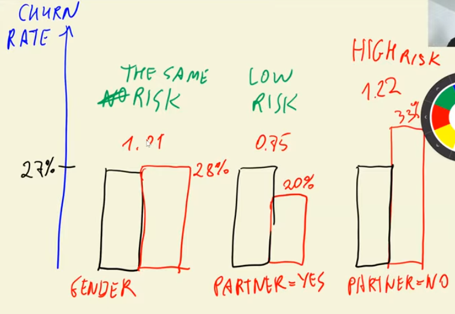

## 3.1 Churn Prediction Project

Imagine we own a telecom company - and we have several clients. 
Naturally, it's possible they're not happy with some of our services and perhaps there's another Telco that they're thinking of subscribing to, instead of us. 

So, churn analysis is the process of identifying and predicting the customers who plan to leave the company/stop using our services. 

Here we're going to score each customer to understand the likelihood of churn. And if there are such clients we want them to be the target of certain promotional ads like discounts, offers, etc.
We're not going to be targetting/spending money on clients who are less likely to churn. 

The ML strategy applied to approach this problem is binary classification, which for one instance ($i^{th}$ customer), can be expressed as:

$$\large g\left(x_{i}\right) = y_{i}$$

In the formula, $y_i$ is the model's prediction and belongs to {0,1}, with 0 being the negative value or no churning, and 1 the positive value or churning. The output corresponds to the likelihood of churning.

In brief, the main idea behind this project is to build a model with historical data from customers and assign a score of the likelihood of churning.

For this project, we used a [Kaggle dataset](https://www.kaggle.com/blastchar/telco-customer-churn).

## 3.2 Data Preparation

Check the [notebook](data-preparation.ipynb). 

## 3.3 Setting the Validation Framework

Check the [notebook](data-preparation.ipynb). 

## 3.4 EDA 

Check the [notebook](data-preparation.ipynb). 

## 3.5 Feature Importance: Churn Rate and Risk Ratio

Check the [notebook](data-preparation.ipynb). 



## 3.6 Feature Importance: Mutual Information 

Check the [notebook](data-preparation.ipynb). 

Mutual Information is a concept from information theory that tells us how much we can learn about one variable if we know the value of another.  

## 3.7 Feature Importance: Correlation

Check the [notebook](data-preparation.ipynb). 

The way to measure feature importance for categorical variables.

## 3.8 One-Hot Encoding

Check the [notebook](data-preparation.ipynb). 

## 3.9 Logistic Regression 

Check the [notebook](data-preparation.ipynb). 

## 3.10 Model Interpretation

Check the [notebook](data-preparation.ipynb). 

## 3.11 Using the model

Check the [notebook](data-preparation.ipynb). 

## MY SUMMARY 

<details>
<summary>ML Workflow: Churn Prediction with DictVectorizer + Logistic Regression</summary>

---

## 1️⃣ Data Preparation

**Raw dataset:** `df`

```
df
├─ features (categorical + numerical)
└─ target: churn (0=no, 1=yes)
```

- Split data into training/validation/test:

```python
df_full_train, df_test = train_test_split(df, test_size=0.2)
df_train, df_val = train_test_split(df_full_train, test_size=0.25)
```

---

## 2️⃣ Training Stage

### 2a. Prepare features

```python
dicts_train = df_train[categorical_features + numerical_features].to_dict(orient='records')
```

- Convert DataFrame to list of dictionaries (one per row) for DictVectorizer.

### 2b. Initialize DictVectorizer

```python
dv = DictVectorizer(sparse=False)
X_train = dv.fit_transform(dicts_train)  # Learn feature mapping and transform
y_train = df_train.churn.values          # Extract target
```

- **Target is removed from X_train** because the model should only see features.

### 2c. Train Logistic Regression

```python
model = LogisticRegression()
model.fit(X_train, y_train)
```

- Model learns weights (`coef_`) and bias (`intercept_`).

---

## 3️⃣ Validation Stage

### 3a. Prepare validation features

```python
dicts_val = df_val[categorical_features + numerical_features].to_dict(orient='records')
X_val = dv.transform(dicts_val)  # Use same feature mapping learned from train
y_val = df_val.churn.values
```

### 3b. Predict and evaluate

```python
y_pred_val = model.predict_proba(X_val)[:, 1]    # Probability of churn
churn_decision = (y_pred_val >= 0.5)            # Threshold
accuracy = (churn_decision == y_val).mean()     # Accuracy score
```

- **No fitting on validation data** — only transform, using mappings learned from train.

---

## 4️⃣ Final Model Training (Train + Validation Combined)

### 4a. Prepare full training features

```python
dicts_full_train = df_full_train[categorical_features + numerical_features].to_dict(orient='records')
X_full_train = dv.fit_transform(dicts_full_train)  # Fit on full train+val
y_full_train = df_full_train.churn.values         # Target needed here
```

- **Target is kept** because the model must learn from all available labeled data.

### 4b. Train final model

```python
model.fit(X_full_train, y_full_train)
```

---

## 5️⃣ Test Stage

### 5a. Prepare test features

```python
dicts_test = df_test[categorical_features + numerical_features].to_dict(orient='records')
X_test = dv.transform(dicts_test)
```

- Transform using **feature mapping learned from full training**.

### 5b. Predict and evaluate

```python
y_pred_test = model.predict_proba(X_test)[:, 1]  # Churn probabilities
churn_decision_test = (y_pred_test >= 0.5)       # Threshold
accuracy_test = (churn_decision_test == y_test).mean()
```

- Evaluate final model performance on **unseen data**.

---

## 6️⃣ Summary Flow

```
df
│
├─ train_test_split → df_full_train + df_test
│
├─ df_full_train → df_train + df_val
│
├─ df_train
│   ├─ drop target → X_train
│   └─ y_train = target
│       ↓
│   LogisticRegression.fit(X_train, y_train)
│       ↓
│   df_val → X_val (transform) + y_val
│       ↓
│   predict_proba → churn predictions → validation accuracy
│
└─ After tuning, df_full_train
    ├─ X_full_train (dicts → DictVectorizer)
    └─ y_full_train (keep target)
        ↓
    LogisticRegression.fit(X_full_train, y_full_train)
        ↓
    df_test → X_test (transform)
        ↓
    predict_proba → final churn predictions → test accuracy
```

- **Key rules:**
  - **Target is removed** whenever transforming features for model input.  
  - **Target is kept** when preparing data for final model fitting.  
  - DictVectorizer must **fit only on training data**; validation/test are just transformed.

</details>

## 3.13 Summary

Just go through the nb. 