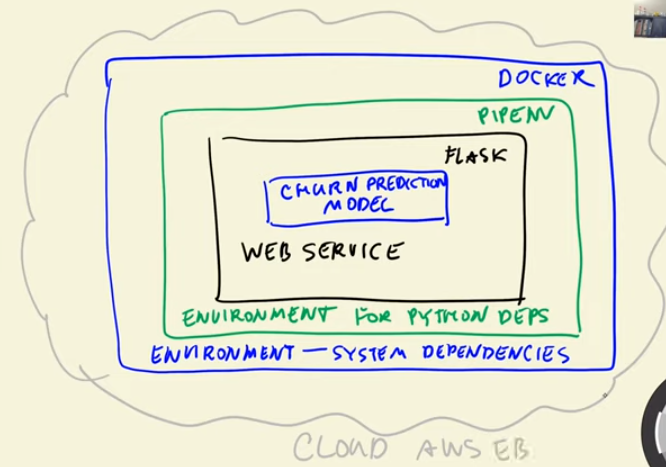

## 5.1 Intro : Session Overview

This week we learn how to deploy ML models as a web service.

We'll take our churn prediction model, and 

1. using flask, we'll put it inside a web service
2. isolate the dependencies (create a special env for py dependencies using pip env) 
3. another layer of for system dependencies, set up using Docker 
4. deploy the entire module into cloud 

## 5.2 Saving and Loading the Model

[Check NB](./data-preparation.ipynb) - last few lines of code. 

The model has been downloaded to module-4/eval_metrics folder

## 5.3 Web Services: Introduction to Flask

[Check app](./test-app.py)

## 5.4 Serving the churn model with Flask

`pip install gunicorn` for wgsi prod server. 

@Rimsha-Bashir ➜ /workspaces/machine-learning-zoomcamp/module-5 (main) $ `gunicorn --bind 0.0.0.0:9696 predict:app`

[check predict-app-test](./predict-app-test.ipynb)

and 

[check predict app](./app.py)