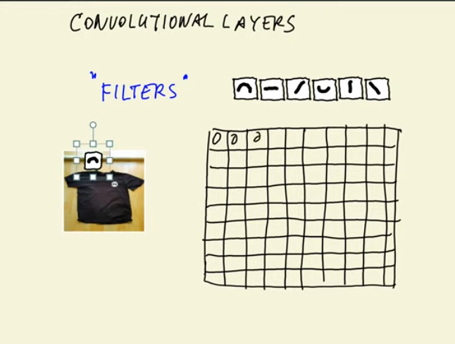
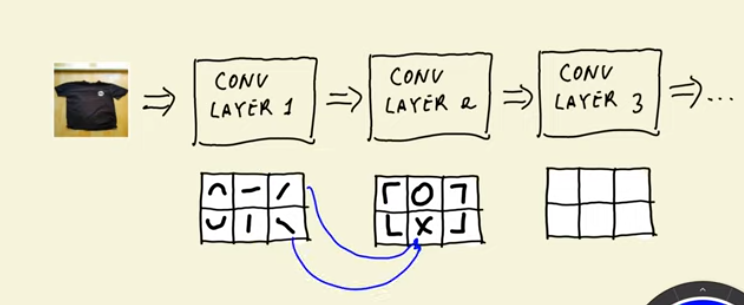
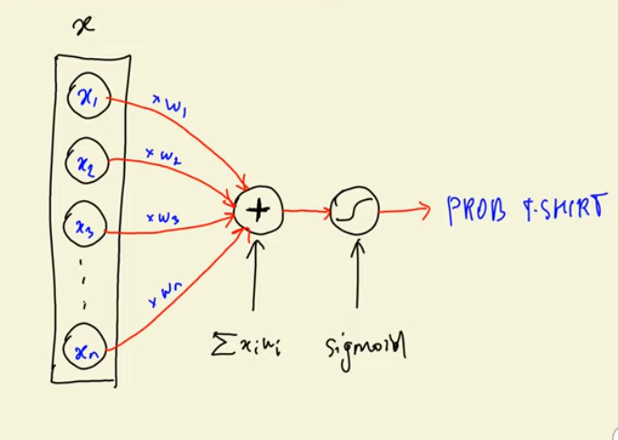
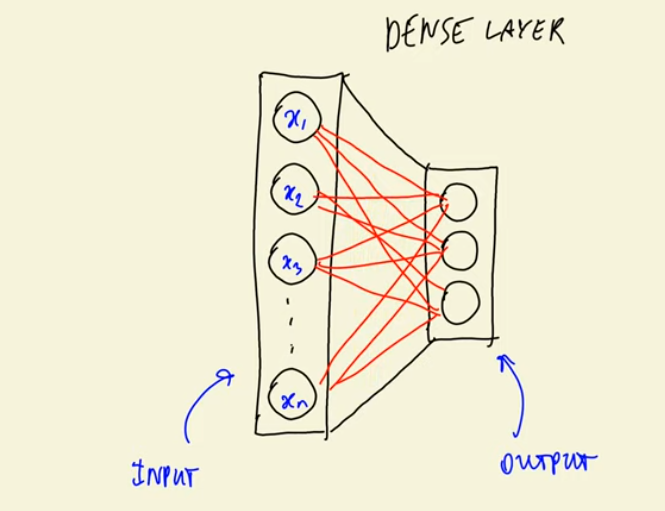
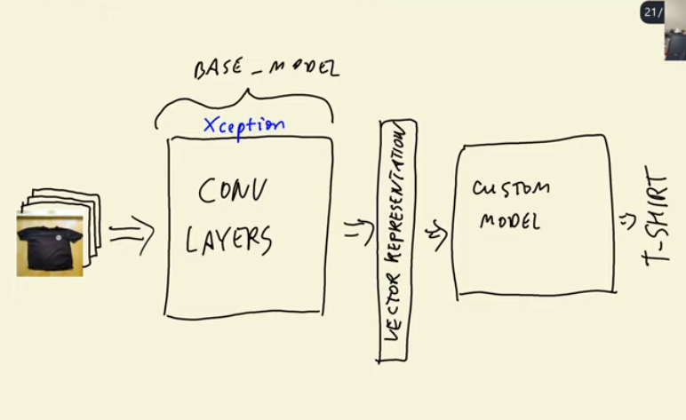
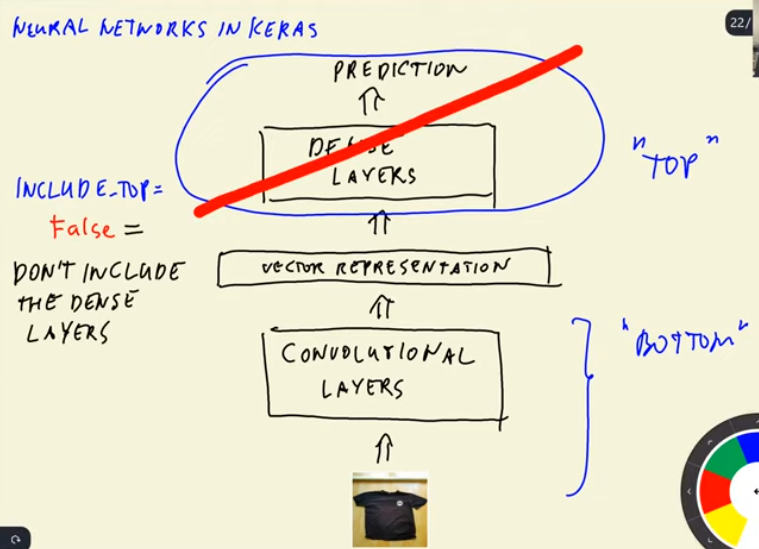
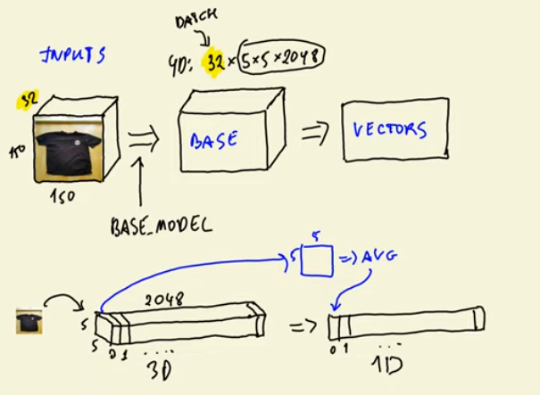
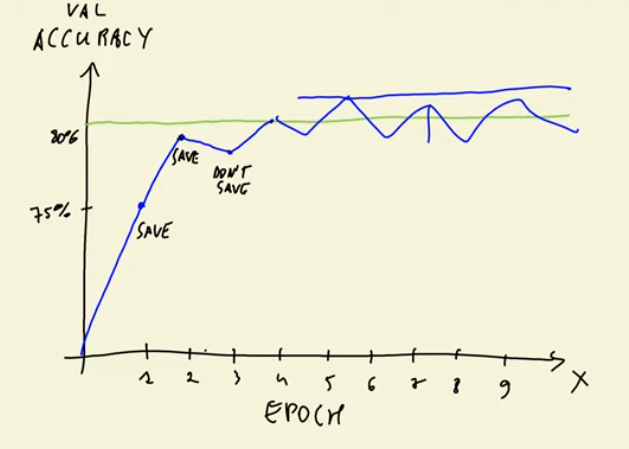
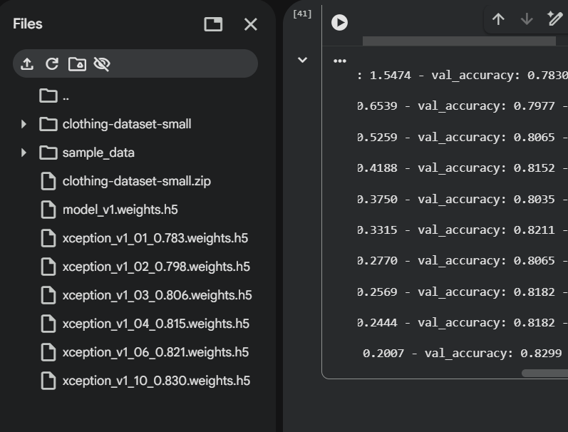
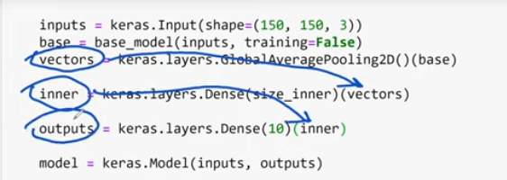

## 8.1 Fashion Classification 

Learning about Neural Network and Deep Learning. 

Example - Fashion Clasification 

This is a multi-class classification where the IMG can be of several different types. In the example were taking, classifying fashion - classes could be T-Shirts, Trousers, Shorts, Skirts etc. 

We'll use a neural net model to accomplish this. 

## 8.2 TensorFlow & Keras

Tensorflow is a framework/open-source library for deep learning created by Google. 

Use cases:
- Recognizing Images 
- Understanding Speech 
- Translating languages
- Making predictions (like stock prices or trends)

Keras is a high-level API built on top of tensorflow - it provides higher level obstruction, so you don't have to write long, complex code. 

TensorFlow does the heavy lifting in the background,
and Keras gives you the friendlier interface to build your models.

```python
from tensorflow import keras
```

What is a GPU (for machine learning)?

A GPU (Graphics Processing Unit) performs thousands of operations in parallel, making it much faster than a CPU for training neural networks.

Can I use a GPU in Jupyter Notebook?

Yes, if your environment provides one.

1. Using Jupyter in the Cloud

Google Colab or Kaggle Notebooks

Free GPUs available.

In Colab:
Runtime → Change runtime type → Hardware accelerator → GPU

Test with:

import tensorflow as tf
print(tf.config.list_physical_devices('GPU'))

2. Using Jupyter on Your Own Computer

You can use GPU acceleration if you have:

An NVIDIA GPU

NVIDIA drivers

CUDA installed

cuDNN installed

TensorFlow installed:

    `pip install tensorflow`


TensorFlow will automatically detect the GPU if configured correctly.

3. If You Do Not Have a GPU

You can still run TensorFlow, but training will be slower.
Cloud notebooks are the easiest way to use a free GPU.

Quick GPU Detection:

```python
import tensorflow as tf
tf.config.list_physical_devices('GPU')
```

If it lists a GPU → GPU is active

If it returns [] → No GPU available

## 8.3 Pre-trained convolution neural networks

[Check nb-1](./fashion-classification.ipynb)
and 
[Check nb-2](https://colab.research.google.com/drive/1BQvZEn11J9XUZj8TqM2zA3gv22kyIahD?usp=sharing)


## 8.4 Convolutional Neural Networks 

[Check nb-2](https://colab.research.google.com/drive/1BQvZEn11J9XUZj8TqM2zA3gv22kyIahD?usp=sharing)

A CNN has two types of layers - convolutional, and dense. 



Convolutional layers consists of `filters` which are like small images (eg. 5x5 sized etc.). It contains simple shapes as seen in the img above. 

and a CNN model runs the filter over the image and outputs a number signifying the likeness/similarity of the filter to the particular part of the image

the resulting matrix is a `feature map`

**there will me as many feature maps as there are filters**

Hence, the output of a convolution layer (CNL1) is the feature map - which can be our new image. 

The next convolution layer has it's own set of filters and produces a new feature map. 

Let's say we have 6 set of features, and so, we'll have 6 feature maps. 



feature set 2 will be more complex than feature set 1 - combination of filters for the first set will look like one from set 2

for ex. (as in the image) 2 slanted lines in opp directions when put together form an `X`


<details>
<summary>NOTES SUMMARY</summary>

1. Filters and Feature Maps

- **Filters** (also called **kernels**) are small matrices, e.g., 3×3 or 5×5, that detect specific patterns in the image (like vertical lines, horizontal lines, or edges). ✅ Correct
- When you **slide a filter over the image** (convolution), it produces a number at each position — this is the **activation**, showing how much that pattern matches that part of the image. ✅ Correct
- Collecting all these numbers gives the **feature map**. ✅ Correct
- You have **one feature map per filter**. ✅ Correct
- Multiple filters can detect multiple patterns in the same image → multiple feature maps per layer. ✅ Correct

Your description of combining simple features (lines) into more complex ones (like an “X”) is also correct — deeper layers capture more complex patterns. ✅

2. Two Layers vs Multiple Convolutional Layers

- Saying a CNN has “two layers: convolutional and dense” usually refers to **types of layers**, not the number of convolutional layers.
- A real CNN usually has **many convolutional layers**, each with its own set of filters.
- First convolutional layers detect **basic patterns** (edges, lines).
- Later convolutional layers detect **more complex patterns** (shapes, corners, objects) by combining feature maps from previous layers.

✅ **“Two types of layers” ≠ only two convolutional layers**

3. Filter vs Filter Set

- Each **filter** detects **one pattern**.
- A **set of filters** in a layer is the collection of all filters in that layer.
- Example:
  - Layer 1: 6 filters → 6 feature maps
  - Layer 2: 6 filters → 6 new feature maps


4. Feature Map as an Image

- A **feature map** is a 2D matrix of numbers. Each number represents how strongly a filter activated at that location.
- You can **visualize it as a grayscale image**, where brighter pixels mean stronger activation.
- After the first convolutional layer, the output (all feature maps) can be treated as a **new image with multiple channels**, which becomes input to the next convolutional layer. ✅

**Example:**

- Input image: 28×28×1 (grayscale)
- Layer 1: 6 filters → 6 feature maps → shape 28×28×6
- Layer 2: 6 filters → each sees all 6 feature maps from Layer 1 → 6 new feature maps → shape 28×28×6 (or smaller if pooling applied)

5. Summary of Key Questions

| Question | Answer |
| --- | --- |
| Two layers vs multiple CNN layers | “Two layers” usually means **types of layers** (convolutional + dense). A CNN can have multiple convolutional layers. |
| Filter set or filter | Each **filter** detects one pattern. The **set of filters** in a layer produces multiple feature maps. |
| Feature map count | One feature map per filter. So 6 filters → 6 feature maps. Each new convolutional layer has its own set of filters → new feature maps. |
| Feature map as an image | A feature map is a 2D matrix of activations. You can **visualize it as an image** to see what the filter is detecting. |


6. Key Clarifications

- “Two layers” = **layer types**, not the literal count of convolutional layers.
- Each convolutional layer usually has multiple filters → multiple feature maps.
- Feature maps can be treated as images → input for the next convolutional layer.
</details>


The output of applying the CONV layers is `vector representation`. 
Now, with this vector rep we create dense layers that give us the final output/prediction, which, here, is say, a t-shirt. 

**For binary classification:**

We take the xi to xn in the vector and multiply it by weights w1 to wn and sum them, then apply the sigmoid fnc (here it will be, t-shirt, or no t-shirt)

g(x) = sigmoid(x<sup>T</sup>w)



**For multiclass classification:**


Here, sigmoid is replaced with `soft max` - generalized fnc, and w is what differs for each item. 

Basically, multiple logistic regression models put together. 



The space/layer between the input and output is what we call the `dense layer` -> because of all the connections between elements of input and outputs. 

Pooling is what makes a feature map smaller. eg. if your feature map is 200x200, then after pooling it has 100x100. 

For an in-depth understanding of how CNN's work for images, check this https://cs231n.github.io/convolutional-networks/


## 8.5 Transfer Learning

Transfer learning is when you take a model (Model A) that has already been trained on a large, general dataset, and reuse part or all of it to help train a new model (Model B) on a smaller or more specific dataset.

Here, we're using the trained layers of convolutional networks for the dense layers.  

input -> conv layers -> vector rep -> dense layers -> prediction

`conv layers + vector rep` are already trained on imagenet and they're more or less generic so we don't need to change them. 

dense layers are specific to the dataset (we disuse what we get from imagenet)

so we keep conv layers and train dense layers. 

....

check gcolab notes 




image -> conv layers -> vector rep

our base model here is Xception. 

we will train the rest (dense layers/custom model part)



Keras uses a bottom up approach and refers to dense layers + output as the top layer and convolutional netw + vector rep + input as the bottom layer

thus, when you create a base_model 

i.e 

base_model = Xception(weights='imagenet', include_top=False, input_shape(150,150,3))

we don't want to use this base model, we only want to extract vector rep from it. 

.... check gcolab



The above is what we call pooling - reducing the dimensionality of something so it can be represented in 1D

.... check gcolab

## 8.6 Adjusting the learning rate

Learning rate is how fast you read/learn. 

If you read 10+ books p/year, you're learning rate is high. 

If you read 4 p/year, you're learning rate is medium 

If you read 1 p/year, you're learning rate is slow. 

It's more likely you learnt everything very well/the best in the last case, but problem is that it takes too long. In case 1, maybe you forget and don't retain info as well, which means our model will do poorly in validation and cause overfitting. 

In case 3, you underfit, because it was possible to learn faster. 

So what we're looking to do is here, is find an appropriate learning rate (no. of books, say) that doesn't comprosomise on performance quality while also taking less time. 


## 8.7 Checkpointing

Way of saving the model after each iteration or after certain conditions are met. 

In a Convolutional Neural Network (CNN), an epoch is a single pass through the entire training dataset.



save_best_only: saves only the best accuracy epochs. 

keras.callbacks.ModelCheckpoint(
    'xception_v1_{epoch:02d}_{val_accuracy:.3f}.h5',
    save_best_only=True, 
    monitor='val_accuracy',
    mode='max' # because we want to maximize accuracy, if we were monitoring losses, then mdode=min
    )

The above is how you create a checkpoint. 



If you observe the image above, you'll note that only the best val_accuracy models are saved. 

## 8.8 Adding more layers 

Here, we add more dense layers. 



Add an inner layer as above ^^ 


## NOTES:

1. Difference between Softmax and Usig Logits. 

What is Softmax? 
Softmax is a function that converts a vector of **raw scores** (called *logits*) into a **probability distribution**.

Given a vector:

\[
z = [z_1, z_2, ..., z_k]
\]

The softmax value for each component is:

\[
\text{softmax}(z_i) = \frac{e^{z_i}}{\sum_{j=1}^{k} e^{z_j}}
\]

This makes:
- all values positive  
- values sum to 1  
- outputs interpretable as probabilities 


What are Logits?
Logits are <b>raw, unnormalized outputs</b> of the final Dense layer:

```python
Dense(10)   # NO activation
```


The numbers:

  Can be positive or negative

  Don’t sum to anything

  Are NOT probabilities


| Concept            | Logits                  | Softmax                        |
| ------------------ | ----------------------- | ------------------------------ |
| What it is         | Raw model outputs       | Probabilities                  |
| Values             | Any real numbers        | 0–1                            |
| Sum                | No constraint           | Sums to 1                      |
| Interpretation     | Not interpretable       | Interpretable as probabilities |
| When used          | With `from_logits=True` | With `from_logits=False`       |
| Typical last layer | `Dense(num_classes)`    | `Dense(num_classes, softmax)`  |


2. Difference between sigmoid and softmax 

| Feature                     | Sigmoid                              | Softmax                                   |
| --------------------------- | ------------------------------------ | ----------------------------------------- |
| Purpose                     | Binary or multi-label                | Multi-class                               |
| Output range                | 0–1                                  | 0–1                                       |
| Sum to 1?                   | ❌ No                                 | ✔️ Yes                                    |
| Classes mutually exclusive? | ❌ No                                 | ✔️ Yes                                    |
| Final layer size            | 1 (binary) or K (multi-label)        | K                                         |
| Works on logits?            | Yes                                  | Yes                                       |
| Loss (logits)               | BinaryCrossentropy(from_logits=True) | CategoricalCrossentropy(from_logits=True) |


3. Difference between Multi-Class and Multi-Label 

| Feature              | Multi-Class                          | Multi-Label                          |
| -------------------- | ------------------------------------ | ------------------------------------ |
| # of correct classes | **1**                                | **Many**                             |
| Output activation    | **Softmax**                          | **Sigmoid (per class)**              |
| Loss                 | categorical_crossentropy             | binary_crossentropy                  |
| Output type          | Probability distribution (sums to 1) | Independent probabilities            |
| Example              | “what type of clothing is this?”     | “what objects appear in this photo?” |


| Function    | Used for                                    | Description                                                 |
| ----------- | ------------------------------------------- | ----------------------------------------------------------- |
| **Sigmoid** | **Binary** or **multilabel** classification | Computes probability *independently for each output neuron* |
| **Softmax** | **Multiclass** classification               | Computes probability *across all classes so they sum to 1*  |


**Logits basically means, there's no activation**


5. "If the loss function already applies softmax internally (in case of using logits), why apply it explicitly?"


You don’t need to.
You should choose one of the following:

Option A — Use logits (NO softmax layer)

```py
Dense(10)  # no activation
loss = CategoricalCrossentropy(from_logits=True)
```

Softmax is applied inside the loss during training.

Option B — Use softmax explicitly

```py
Dense(10, activation="softmax")
loss = CategoricalCrossentropy(from_logits=False)
```

Softmax happens in the model.

Never do both.
Never do neither.


If you train with logits (no softmax), then after training:

```py
preds = model.predict(x)
```

will output raw logits, not probabilities.

| Scenario                                     | Last Layer                        | Loss               | Where softmax happens?        |
| -------------------------------------------- | --------------------------------- | ------------------ | ----------------------------- |
| **Logits training**                          | `Dense(10)`                       | `from_logits=True` | Inside loss                   |
| **Softmax training**                         | `Dense(10, activation="softmax")` | default            | Inside model                  |
| **Using softmax + from_logits=True (WRONG)** | ❌                                 | ❌                  | Double softmax = bad          |
| **Logits + from_logits=False (WRONG)**       | ❌                                 | ❌                  | No softmax = meaningless loss |


6. How are the training labels hidden from the model (ex. in linear regression we remove the target variable from the dataset so the model doesn't learn it)?

#### Understanding Training with Pretrained Models and Labels

##### 1. Where are the true labels coming from?

When doing image classification with a folder structure like:

train/
tshirt/
skirt/
...
validation/
tshirt/
skirt/
...
test/
tshirt/
skirt/
...

markdown
Copy code

- Each **subfolder name** is automatically treated as a **class label**.  
- Keras’ `flow_from_directory` scans the folder names and assigns numeric labels internally:
  - `tshirt → 0`  
  - `skirt → 1`  
  - etc.  
- The generator produces `(batch_images, batch_labels)` for training.

##### Important:
- You **do not manually remove or separate the labels**; the generator handles it automatically.
- This avoids the model overfitting on labels because it only sees the images and the assigned class during training.

---

##### 2. What happens internally when training with a pretrained model (e.g., Xception)?

1. **Input images** are fed into the pretrained Xception backbone.
2. **Preprocessing**: Images are normalized to match what Xception expects (`preprocess_input`).
3. **Feature extraction**: Xception convolutional layers detect edges, textures, and shapes.
4. **Global Average Pooling**: Reduces spatial feature maps into a single vector per image.
5. **Custom Dense layer**: Outputs predictions (softmax probabilities or logits) for your 10 clothing classes.
6. **Loss calculation**:
   - The model compares predicted probabilities with the **true labels** provided by `flow_from_directory`.
   - Loss function (e.g., categorical crossentropy) computes the error.
7. **Backpropagation**:
   - Gradients are calculated only for trainable layers (your Dense classifier).
   - Base Xception layers are frozen (`trainable=False`), so their weights do **not** change.

---

##### 3. How does this avoid overfitting?

- By freezing the pretrained layers:
  - Only the new classifier is trained.
  - Prevents the model from memorizing small datasets.
- The backbone already contains useful generalized features from ImageNet.
- Labels are provided only through folder structure, not embedded in the images themselves.

---

##### 4. Summary

- Labels come **directly from folder names**.  
- Pretrained models act as feature extractors.  
- Only the new Dense layers are trained to map extracted features to your dataset classes.  
- This setup ensures proper transfer learning without overfitting to the training 