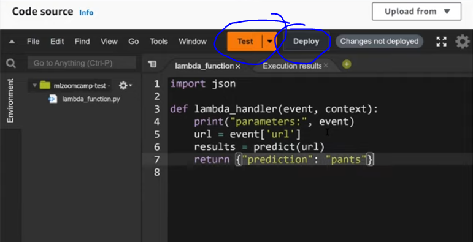

## 9.1 AWS Lamda

- Create a function in lambda - select specfications.An IDE like window opens up for you to code your function
- Click on Test dropdown to define and declare parameters for 'event'
- Click on Test/Deploy to see the results.

We don't need to create EC2 instances etc, since lambda is serverless. And we're charged only when the lambda function is doing something (event sent/triggered)

