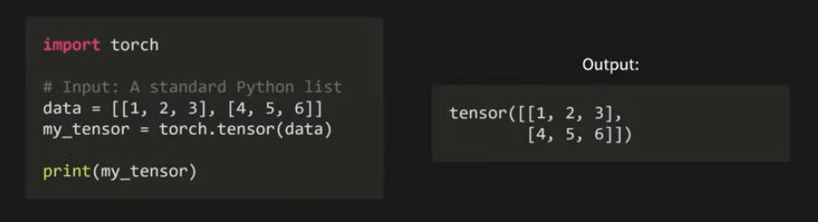
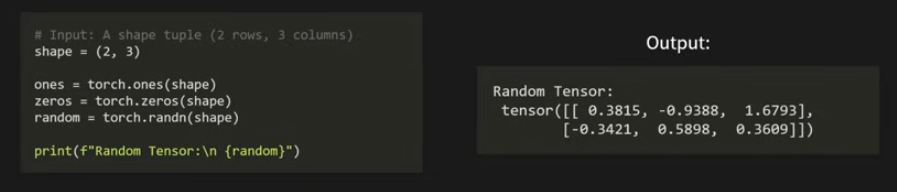
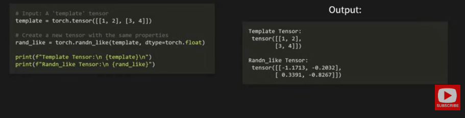
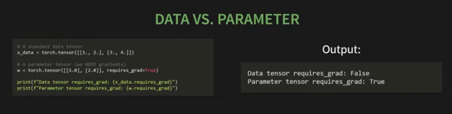
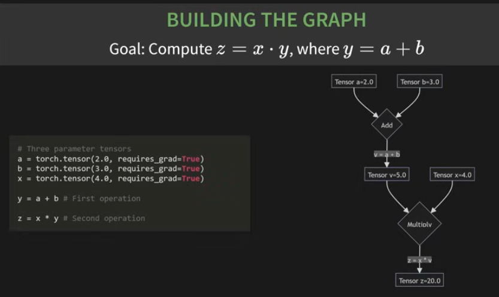
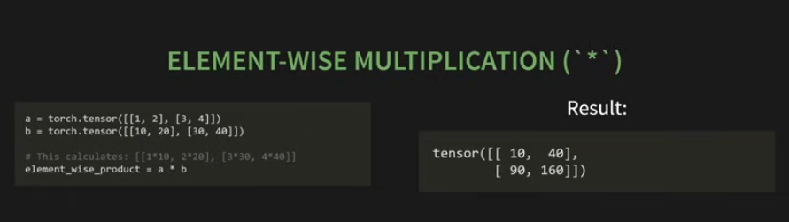
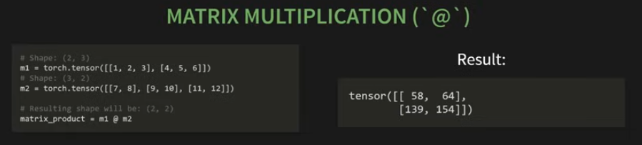
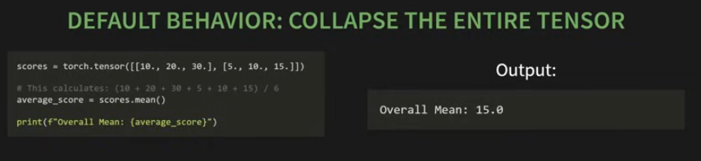
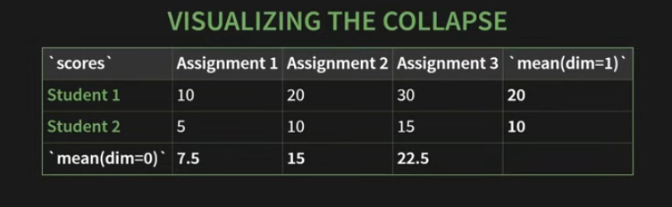

## Learning PyTorch

### CHECK THE [JNB](./learning-pytorch.ipynb) FOR HANDS-ON

[YT Link](https://www.youtube.com/watch?v=r1bquDz5GGA)

`Tensor` - torch.Tensor is the basic building block of PyTorch. 

### Three ways/patterns to create a tensor:

1. Direct creation from data:



2. Creation from a desired shape:

Commonly used when initializing model weights. 



3. Creation by mimicking another tensor:




### What's inside a tensor?

A tensor has three critical attributes - shape, datatype and device. 

.shape: a tuple describing dimensions, ex. (2,3) means 2 rows and 3 columns. (:warning: 90% of errors in pytorch will be because of type mismatches)

.device: tells us where the tensor lives, i.e, in CPU or CUDA(GPU)

.dtype: the data type of numbers in the tensor, the default is float. It is float because of gradients. The entire ML engine runs on weights/biases adjustments (ex. 3.000 to 3.001). Whatever `learns` has to be a float32. 

What is Autograd?

Autograd : Automatic differentiation. 
It's PyTorch's built in gradient calculator and it can be activated by the below parameter:

`requires_grad=True`

By default, a tensor is just data, to tell PyTorch that it's a learnable parameter, you must set `requires_grad=True`. By doing so, you're sending a message to the autograd engine, "This is a parameter. From now on, track every single operation that happens to it"



Note that by defailt, requires_grad is False.

As soon as the parameter is set, PyTorch begins to build a computation graph 

Let's say we compute z=x.y, where y=a+b 



Every computational graph built is stored, and to access it, you can use the attribute - `.grad_fn`

### Operations 

1. Element-wise multiplication (`*`)

Multiplies matching positions. 
Key rule: Tensors must have the exact same shape. 



2. Matrix Multiplication (`@`)

Powers neural networks!!

Rule: Matrix1 Columns = Matrix2 Rows



### Reduction Operation 

A `reduction` is any operation that reduces a tensor to a smaller number of elements. 



The `dim` argument lets you control "which direction to collapse"

dim=0; collases rows, operates "vertically"
dim=1; collapses columns, operates "horizontally"





1. Selecting data

    - Basic Indexing (check jnb)
    - Dynamic Selection (check jnb) - `torch.argmax()`
    - Standard Indexing (check jnb) - `torch.gather()`

2. Forward Pass

We'll implement a model's first guess (it's random) using only the raw tensor operation we've just learned. 

Starting with Simple Linear Regression

y = Xw + b 

`w` and `b` are knobs our model can turn. So, we need to find the perfect w and b so y is closest to the real target value. 

Check JNB. 

#### What is a backward pass?

A backward pass is the step where a neural network figures out how to change its parameters (weights and biases) to reduce error.

In simple terms:

Forward pass = make a prediction
Backward pass = figure out how wrong it was and how to fix it

example:

```python 

import torch

x = torch.tensor(2.0)
W = torch.tensor(3.0, requires_grad=True)

y = W * x

# This is the forward pass.
# What happened? Input: x = 2, Weight: W = 3, Output: 6

# Now, define loss. 

loss = (y - 10) ** 2

# Error = 6 - 10 = -4
# Loss = (-4)^2 = 16 

loss.backward()

# This tells PyTorch: “Figure out how changing W affects the loss.”

print(W.grad)

```

Output:

tensor(-16.)

Meaning, if you increase W slightly, the loss will decrease. 

The number -16 tells:

Direction (negative = increase W)

Strength (how much it matters)

Note:

| Sign of gradient | Meaning                                          |
| ---------------- | ------------------------------------------------ |
| **Positive (+)** | Increasing the weight makes the error **worse**  |
| **Negative (−)** | Increasing the weight makes the error **better** |


So, if W.grad = -16
It means:
“Increase W to reduce the error.”

Why do we care about the sign?

`new_weight = old_weight − learning_rate × gradient`

i.e when gradient increases, the new_weight decreases. 
if gradient is small, the new_weight needs to be increased. 
**So the sign controls the direction of learning.**

Think of it like this:

16 → changing the weight matters a lot

1 → changing the weight matters a little

0 → changing the weight doesn’t matter

So 16 is the strength of the signal.


### Difference between TensorFlow and PyTorch 

| Aspect              | PyTorch   | TensorFlow |
| ------------------- | --------- | ---------- |
| Learning curve      | Easier    | Steeper    |
| Debugging           | Very easy | Harder     |
| Research popularity | Very high | Moderate   |
| Production tools    | Good      | Excellent  |
| Mobile & edge       | Limited   | Strong     |
| Flexibility         | High      | Medium     |
| Performance         | Excellent | Excellent  |

<details><summary>details here^</summary>

## 2. Shared Core Ideas (TensorFlow & PyTorch)

Both frameworks:

- Use **tensors** as the main data structure  
- Support **GPU / TPU acceleration**  
- Automatically compute **gradients** (backpropagation)  
- Can train **deep neural networks**  
- Are used in **research and production**

So the difference is **not what they can do**, but **how they feel and where they shine**.

---

## 3. The Fundamental Difference (Mental Model)

### PyTorch: *“Define-by-Run” (Dynamic)*

- Code runs **line by line**
- The computation graph is built **as the code executes**
- Feels like **normal Python**

### TensorFlow: *“Define-then-Run” (Historically Static)*

- You define a **computation graph** first
- Then **execute** it
- More **structured** and optimized for **deployment**

> Modern TensorFlow (with eager execution) feels more like PyTorch, but the **design philosophy difference still exists**.

---

## 4. PyTorch Explained

### What PyTorch Feels Like

- Very **Pythonic**
- **Easy to debug**
- **Flexible**

### Why People Choose PyTorch

- Research-friendly
- Rapid experimentation
- Easy to understand model behavior

### Typical Use Cases

- Academic research
- Prototyping new models
- Custom architectures
- Computer vision research
- NLP research

### Example Thought

> *“I want to try something weird with my model during training.”*

**PyTorch says:**  
👉 *No problem, just write Python code.*

---

## 5. TensorFlow Explained

### What TensorFlow Feels Like

- More **structured**
- More tools **out-of-the-box**
- Strong **deployment ecosystem**

### Why People Choose TensorFlow

- Production deployment
- Mobile and embedded devices
- Large-scale systems

### Typical Use Cases

- Production ML systems
- Mobile ML (**TensorFlow Lite**)
- Web ML (**TensorFlow.js**)
- Large enterprise pipelines
- Serving models at scale

### Example Thought

> *“I want to train a model and deploy it everywhere.”*

**TensorFlow says:**  
👉 *Here’s a complete ecosystem.*
</details>